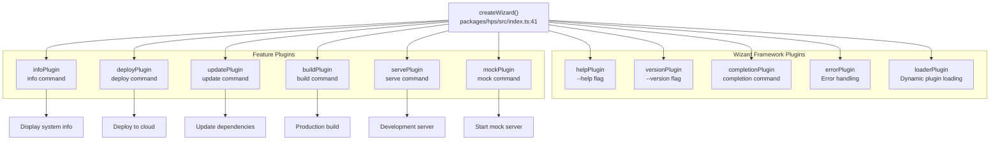
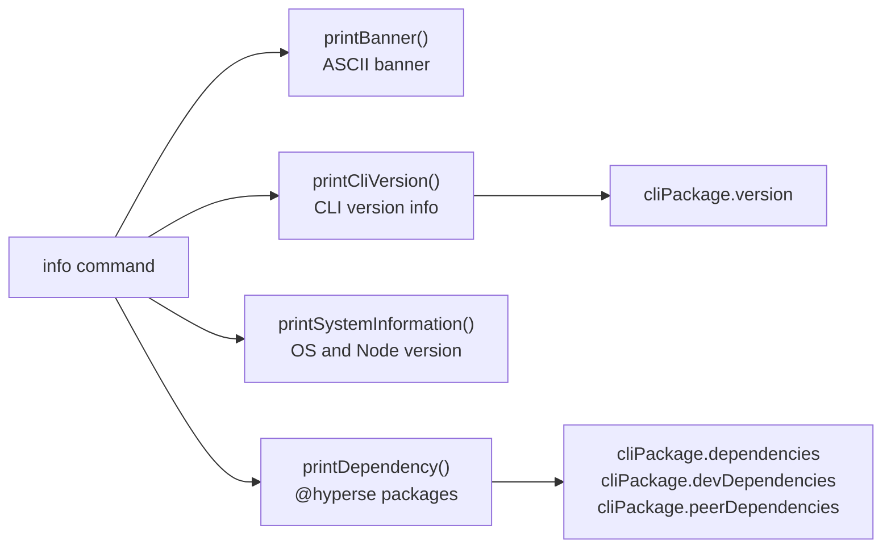
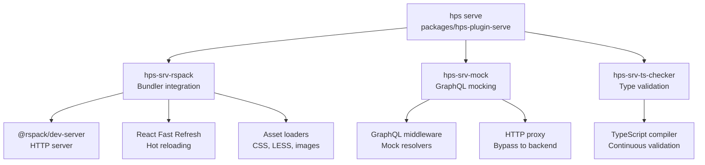
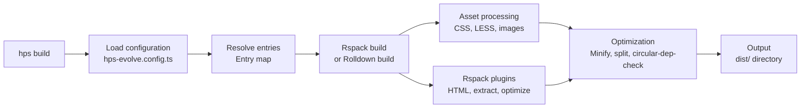
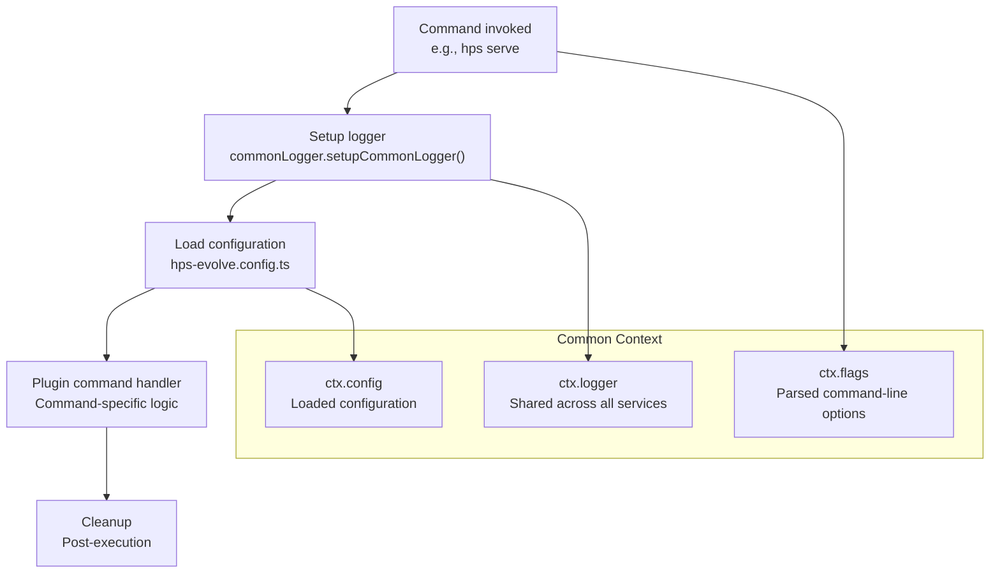

# CLI Commands

## Command Architecture

The HPS CLI provides commands through a plugin-based architecture. Each command is registered by a plugin during CLI initialization.

### Command Registration Flow



## Global Options

All commands support the following global options inherited from the Wizard framework:

| Option       | Description                               | Type    |
| ------------ | ----------------------------------------- | ------- |
| `--help`     | Display help information for a command    | boolean |
| `--version`  | Display CLI version                       | boolean |
| `--no-color` | Disable colored output                    | boolean |
| `--locale`   | Set locale for internationalized messages | string  |

## Built-in Commands

### `completion`

Generate shell completion scripts for the HPS CLI.

**Syntax:**

```bash
hps completion [shell]
```

**Description:**
Generates shell completion scripts for bash, zsh, or fish shells. This enables tab-completion for HPS commands and options.

**Usage:**

```bash
# Generate completion script
hps completion

# Install completion for current shell
hps completion >> ~/.bashrc
```

## Information Commands

### `info`

Display system information, CLI version, and platform dependencies.

**Syntax:**

```bash
hps info
```

**Description:**
Prints comprehensive information about the HPS CLI installation, including:

- CLI version
- System information (OS, Node.js version)
- @hyperse platform dependencies

**Output Sections:**



**Example Output:**

```bash
  _  _  _    _   ___   ___   ___   ___   ___
 | || | \ \ / / | _ \ | __| | _ \ / __| | __|
 | __ |  \ V /  |  _/ | _|  |   / \__ \ | _|
 |_||_|   |_|   |_|   |___| |_|_\ |___/ |___|


  ✨ Next-Generation CLI • Powered by Hyperse

  ✔ @hyperse CLI
   @hyperse CLI Version : 0.1.0-next.25


  ✔ System Information
   OS Version     :  macOS Tahoe
   NodeJS Version :  v22.13.1

  ✔ @hyperse Platform Information
   wizard-plugin-completion ➞ version : 1.0.3
   wizard-plugin-version ➞ version    : 1.0.6
   eslint-config-hyperse ➞ version    : 1.4.8
   wizard-plugin-loader ➞ version     : 1.0.6
   wizard-plugin-error ➞ version      : 1.0.6
   wizard-plugin-help ➞ version       : 1.0.6
   ...
```

**Package Structure:**

| Function                   | Purpose                  |
| -------------------------- | ------------------------ |
| `createInfoPlugin()`       | Plugin factory           |
| `printBanner()`            | Display ASCII banner     |
| `printCliVersion()`        | Show CLI version         |
| `printSystemInformation()` | Show OS and Node version |
| `printDependency()`        | List @hyperse packages   |

---

## Development Commands

### `serve`

Start the development server with hot module replacement and optional API mocking.

**Syntax:**

```bash
hps serve [entry] [options]
```

**Arguments:**
| Argument | Description | Required | Default |
|----------|-------------|----------|---------|
| `entry` | Entry name to serve (maps to entry in configuration) | No | All entries |

**Options:**
| Option | Description | Type | Default |
|--------|-------------|------|---------|
| `--projectCwd` | Project working directory | string | `process.cwd()` |

**Description:**
Starts a development server with Rspack bundler integration, providing:

- Hot Module Replacement (HMR)
- React Fast Refresh
- TypeScript type checking
- GraphQL API mocking (if configured)
- Static page serving

**Example Usage:**

```bash
# Start dev server for all entries
hps serve

# Start dev server for specific entry
hps serve evolve

# Use custom project directory
hps serve evolve --projectCwd /path/to/project
```

**Integration with Services:**



**Configuration:**
The serve command uses configuration from `hps-evolve.config.ts`. See [Dev Server Options](#5.2) for detailed configuration options.

### `build`

Create an optimized production build.

**Syntax:**

```bash
hps build [entry] [options]
```

**Arguments:**
| Argument | Description | Required | Default |
|----------|-------------|----------|---------|
| `entry` | Entry name to build (maps to entry in configuration) | No | All entries |

**Description:**
Executes a production build using Rspack or Rolldown bundler, applying:

- Code minification
- Tree shaking
- Code splitting with configurable chunk sizes
- CSS extraction and optimization
- Circular dependency detection
- Source map generation

**Example Usage:**

```bash
# Build all entries
hps build

# Build specific entry
hps build evolve
```

**Build Pipeline Flow:**



**Integration with Services:**

- Bundler service: [hps-srv-rspack](#4.1) or [hps-srv-rolldown](#4.4)
- TypeScript checking: [hps-srv-ts-checker](#4.3)
- Common utilities: [hps-srv-common](#4.5)

**Output:**
Production-optimized bundles are written to the `dist/` directory by default. See [Output Configuration](#6.3) for details.

### `mock`

Start a standalone GraphQL mock server for API development.

**Syntax:**

```bash
hps mock [options]
```

**Description:**
Starts a dedicated mock server for GraphQL APIs without running the full development server. Useful for:

- Backend team development
- API contract testing
- Frontend development without backend dependency

The mock server uses configuration from `hps-mock.config.ts` to determine:

- GraphQL endpoints and priorities
- Mock vs. bypass strategies
- Operation-level overrides
- Schema introspection

**Configuration:**
Mock configuration is defined using `defineGraphqlMock()` helper. See [Mock Configuration](#4.2.2) for details.

---

## Utility Commands

### `deploy`

Deploy build artifacts to cloud storage (Aliyun OSS).

**Syntax:**

```bash
hps deploy [options]
```

**Description:**
Uploads build artifacts from the `dist/` directory to Aliyun OSS (Object Storage Service). Supports:

- Recursive directory upload
- MIME type detection
- Progress indication
- Custom path prefixes

**Options:**
Configuration is typically provided through `hps-evolve.config.ts` under the `deploy` section, including:

- OSS credentials
- Bucket name
- Region
- Relative path prefix

### `update`

Update workspace dependencies to their latest versions.

**Syntax:**

```bash
hps update [options]
```

**Options:**
| Option | Description | Type | Default |
|--------|-------------|------|---------|
| `--deep` | Enable recursive updates across workspace packages | boolean | `false` |

**Description:**
Updates package dependencies using `npm-check-updates` to find and upgrade to the latest versions. In monorepo setups, processes all workspace packages.

**Features:**

- Detects Yarn workspaces using `@manypkg/get-packages`
- Updates `package.json` files
- Supports both shallow (direct dependencies) and deep (recursive) updates
- Preserves package manager lockfile

**Example Usage:**

```bash
# Update dependencies in current package
hps update

# Recursive update across all workspace packages
hps update --deep
```

## Command Execution Context

### Interceptor Chain

All commands execute through an interceptor chain that sets up common context:



**Interceptor Setup:**
The common logger is configured globally for all commands at [packages/hps/src/index.ts:55-64](), ensuring consistent logging across plugins and services.

```typescript
// Interceptor that runs before all commands
wizard.interceptor(async (ctx, next) => {
  commonLogger.setupCommonLogger(ctx.logger);
  await next();
});
```

**Configuration Loading:**
Configuration is loaded using `@hyperse/config-loader` with the following settings:

- Config file pattern: `hps`
- Supported formats: `.ts`, `.js`, `.mjs`
- Externals: All `@hyperse/*` packages are treated as external

---

## Command to Plugin Mapping

The following table shows how commands map to their implementing plugins:

| Command      | Plugin Package                      | Factory Function           |
| ------------ | ----------------------------------- | -------------------------- |
| `info`       | `@hyperse/hps-plugin-info`          | `createInfoPlugin()`       |
| `deploy`     | `@hyperse/hps-plugin-deploy`        | `createDeployPlugin()`     |
| `update`     | `@hyperse/hps-plugin-update`        | `createUpdatePlugin()`     |
| `build`      | `@hyperse/hps-plugin-build`         | `createBuildPlugin()`      |
| `serve`      | `@hyperse/hps-plugin-serve`         | `createServePlugin()`      |
| `mock`       | `@hyperse/hps-plugin-mock`          | `createMockPlugin()`       |
| `completion` | `@hyperse/wizard-plugin-completion` | `createCompletionPlugin()` |
