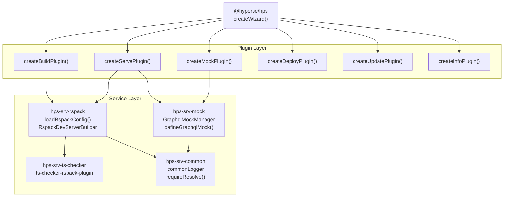

import { compileMdx } from 'nextra/compile';
import { MDXRemote } from 'nextra/mdx-remote';

# Introduction

HPS (@hyperse-io/hps) is the next-generation build tool designed for modern web apps. Built on Rspack, it delivers instant startup, lightning-fast HMR, and zero-config deployment.

## Three-Tier Architecture

The HPS system follows a clear separation of concerns across three architectural layers:

| Layer       | Purpose                               | Package Pattern            | Examples                                       |
| ----------- | ------------------------------------- | -------------------------- | ---------------------------------------------- |
| **CLI**     | User interface, command orchestration | **@hyperse/hps**           | Core CLI, command parsing                      |
| **Plugin**  | Feature implementation                | **@hyperse/hps-plugin-\*** | build, serve, mock, deploy, update, info, pack |
| **Service** | Technical implementation              | **@hyperse/hps-srv-\***    | rspack, rolldown, mock, ts-checker, common     |

Each layer has well-defined responsibilities and dependencies flow downward: CLI depends on Plugins, Plugins depend on Services.

### Layer Interaction Diagram

