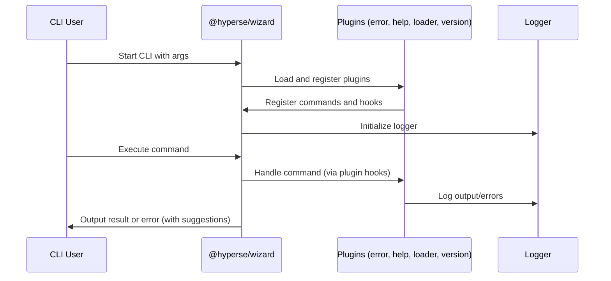

import { compileMdx } from 'nextra/compile';
import { MDXRemote } from 'nextra/mdx-remote';

# Introduction

HPS is a blazing fast frontend build tool based on Rspack that powers the next generation of web applications.

## Three-Tier Architecture

The HPS system follows a clear separation of concerns across three architectural layers:

|Layer|Purpose|Package Pattern|Examples
|-----|-------|---------------|--------
**CLI Layer**|User interface, command orchestration|**@hyperse/hps**|Core CLI, command parsing
**Plugin Layer**|Feature implementation|**@hyperse/hps-plugin-***|build, serve, mock, deploy, update, info, pack
**Service Layer**|Technical implementation|**@hyperse/hps-srv-***|rspack, rolldown, mock, ts-checker, common

Each layer has well-defined responsibilities and dependencies flow downward: CLI depends on Plugins, Plugins depend on Services.

# Mermaid

Nextra supports [mermaid](https://mermaid.js.org) diagrams. Like in GitHub you
can use it in your Markdown files by using the `mermaid` code block language.
Out of the box, Nextra uses
[`@theguild/remark-mermaid`](https://npmjs.com/package/@theguild/remark-mermaid)
package that replaces the code block with the `<Mermaid>` component.

## Example

<Demo />

export async function Demo() {
  const mermaidCodeblock = `\`\`\`mermaid
graph TD;
subgraph AA [Consumers]
A[Mobile app];
B[Web app];
C[Node.js client];
end
subgraph BB [Services]
E[REST API];
F[GraphQL API];
G[SOAP API];
end
Z[GraphQL API];
A --> Z;
B --> Z;
C --> Z;
Z --> E;
Z --> F;
Z --> G;
\`\`\``;
  const rawJs = await compileMdx(`${mermaidCodeblock}
## Usage
~~~md filename="Markdown"
${mermaidCodeblock}
~~~
`);
  return <MDXRemote compiledSource={rawJs} components={{ Mermaid }} />;
}